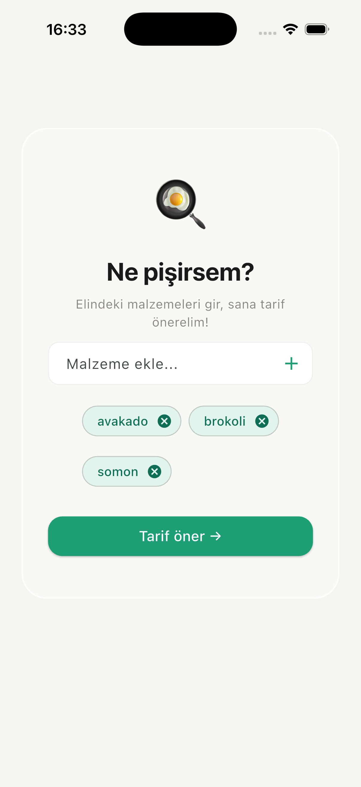
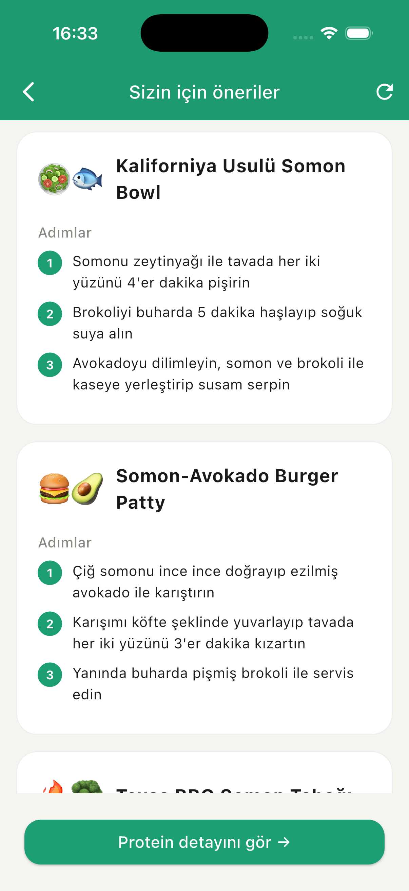
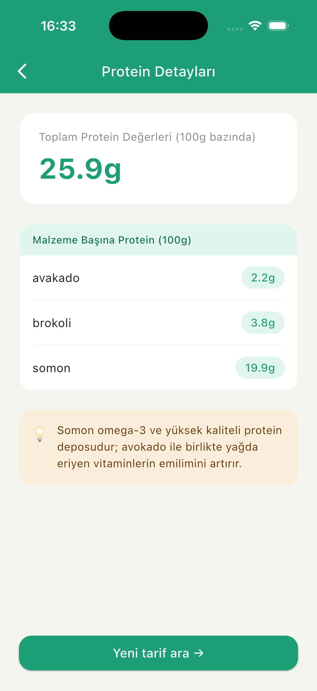

# 🍳 Buzdolabı AI Şefi

> Buzdolabını aç, malzemeleri gir — yapay zeka şefin devreye girsin.

Buzdolabında ne olduğunu biliyorsun ama ne pişireceğini bilmiyorsun. Buzdolabı AI Şefi tam da bunun için var. Elindeki malzemeleri gir, Claude AI sana 3 farklı protein odaklı tarif önersin. Üstelik her malzemenin protein değerini USDA'nın devasa yiyecek veritabanından gerçek zamanlı çeker.

---

## 📸 Ekran Görüntüleri

<p float="left">
  
  
  
</p>

---

## ✨ Özellikler

- 🤖 Claude AI ile akıllı tarif önerisi — aynı malzemelerle her seferinde farklı tarifler
- 🥩 Gerçek protein hesabı — USDA FoodData veritabanından 100g başına değerler
- 🌍 Türkçe malzeme desteği — otomatik İngilizceye çeviri
- 🔄 Yeni tarif üret — beğenmediğin tarifleri tek tuşla yenile
- ⚡ Paralel API istekleri — hızlı yanıt için tüm malzemeler aynı anda işlenir
- 📱 Cross-platform — iOS, Android ve Web

---

## 🛠️ Teknolojiler

**Backend:** Python, FastAPI, Anthropic Claude API, USDA FoodData API

**Frontend:** Flutter, Dart

---

## 🚀 Kurulum

### Backend

```bash
cd backend
python3 -m venv venv
source venv/bin/activate
pip install -r requirements.txt
cp .env.example .env
uvicorn main:app --reload
```

### Frontend

```bash
cd frontend
flutter pub get
flutter run
```

---

## 🔑 Gerekli API Key'ler

- **Anthropic Claude** → [console.anthropic.com](https://console.anthropic.com)
- **USDA FoodData** → [fdc.nal.usda.gov](https://fdc.nal.usda.gov/api-guide.html)

Her iki servis de ücretsiz başlangıç kredisi sunuyor.

---

## 👩‍💻 Geliştirici

**Melike Hazal Özcan**

*Bu proje Claude AI ile birlikte geliştirilmiştir.* 🤖
